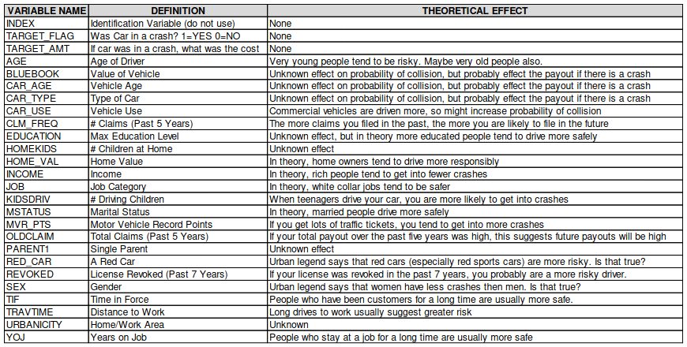

```{r setup, include=FALSE}
knitr::opts_chunk$set(echo = TRUE, include = FALSE)

library(tidyverse)
library(mice)
library(MASS)
library(caret)
library(pROC)

set.seed(1337)

scrub <- function(df) {
  f1 <- function(x) {
  return(as.numeric(gsub('[\\$,]', '', x)))}
  
  f2 <- function(x) {
  return(as.character(gsub('[z_,]', '', x)))}
  
  df <- tibble(df)[,2:26] %>%
    mutate(
      TARGET_FLAG = as.factor(as.logical(df$TARGET_FLAG)),
         TARGET_AMT = as.numeric(df$TARGET_AMT),
         KIDSDRIV = as.numeric(df$KIDSDRIV),
         AGE = as.numeric(df$AGE),
         HOMEKIDS = as.numeric(df$HOMEKIDS),
         YOJ = as.numeric(df$YOJ),
         INCOME = as.numeric(f1(df$INCOME)),
         PARENT1 = as.logical(lapply(df$PARENT1,
                       function(x) if(x == 'Yes') 1 else 0)),
         HOME_VAL = as.numeric(f1(df$HOME_VAL)),
         MSTATUS = as.logical(lapply(f2(df$MSTATUS),
                       function(x) if(x == 'Yes') 1 else 0)),
         SEX = as.logical(lapply(f2(df$SEX),
                   function(x) if(x == 'M') 1 else 0)),
         EDUCATION = as.factor(f2(df$EDUCATION)),
         JOB = as.factor(as.character(lapply(f2(df$JOB),
                       function(x) if(x == '') 'None' else x))),
         TRAVTIME = as.numeric(df$TRAVTIME),
         CAR_USE = as.logical(lapply(df$CAR_USE,
                       function(x) if(x == 'Private') 1 else 0)),
         BLUEBOOK = as.numeric(f1(df$BLUEBOOK)),
         TIF = as.numeric(df$TIF),
         CAR_TYPE = as.factor(f2(df$CAR_TYPE)),
         RED_CAR = as.logical(lapply(df$RED_CAR,
                       function(x) if(x == 'yes') 1 else 0)),
         OLDCLAIM = as.numeric(f1(df$OLDCLAIM)),
         CLM_FREQ = as.numeric(df$CLM_FREQ),
         REVOKED = as.logical(lapply(df$REVOKED, 
                       function(x) if(x == 'Yes') 1 else 0)),
         MVR_PTS = as.numeric(df$MVR_PTS),
         CAR_AGE = as.numeric(df$CAR_AGE),
         URBANICITY = as.logical(lapply(f2(df$URBANICITY), 
                                        function(x) if(x == 'Highly Urban/ Urban') 
                                          1 else 0)))
  levels(df$EDUCATION) <- c(0,2,1,3,4)
  return(df)
}

df.t <- scrub(read.csv('insurance_training_data.csv'))
df.e <- scrub(read.csv('insurance-evaluation-data.csv'))
```

# Exposition

We've got about 8k observations concerning car insurance customer attributes.  We will be using this data to predict two target variables:

>TARGET_FLAG, a binary value indicating if the customer crashed their vehicle, 

>TARGET_AMT, a value equal to 0 if TARGET_FLAG is zero, else it is positive.

To accomplish this task, we will be training multiple linear regression and binary logistic regression models.  First, we will use a function to clean the data and explicitly declare data types on all variables. Then, we will impute the missing information before training the models.




# Data Exploration


```{r, include=TRUE}
summary(df.t)
colSums(is.na(df.t))
ggplot(df.t, aes(x = AGE)) + geom_point(aes(y = log(TARGET_AMT))) + theme_minimal()
ggplot(df.t, aes(x = TRAVTIME)) + geom_point(aes(y = log(TARGET_AMT))) + theme_minimal()
ggplot(df.t, aes(x = log(OLDCLAIM))) + geom_point(aes(y = log(TARGET_AMT))) + theme_minimal()
ggplot(df.t, aes(x = YOJ)) + geom_histogram(binwidth = 0.25)
```

There is missing information in AGE, YOJ, INCOME, HOME_VAL, and CAR_AGE.  We will chain the equations starting from AGE to impute the missing data.

# Data Preparation

Here we can see the distributions of some of the missing information.

```{r, include=TRUE}
df.t %>% filter(is.na(YOJ)) %>% ggplot(aes(x = JOB)) +
  geom_histogram(stat = 'count') + ggtitle('Null values in YOJ')

df.t %>% filter(is.na(INCOME)) %>% ggplot(aes(x = AGE)) +
  geom_histogram(stat = 'count') + ggtitle('Null values in INCOME')
```


```{r}
fill.missing <- function(df1, df2) {
  x <- rbind(df.t, df.e)[,3:25]
  y <- mice(x, maxit = 20)
  z <- complete(y, 1)
  
  imp <- c(2,4,5,7,22)
  complete <- cbind(x[,-imp], z[,imp])
  return(complete)
}

full <- fill.missing(df.t, df.e)

tr <- full[1:8161,]
ev <- full[8162:10302,]

anyNA(tr)
anyNA(ev)
```


# Build Models

We begin with a binomial GLM containing all variables, and then use bidirectional stepwise selection to come with the best model relatively.  Then we train the multiple regression with a gaussian glm and use bidirectional model selection again.

It's important to remember to include each term multiplied by the logical value TARGET_FLAG, to encourage the model not to predict a TARGET_AMT when TARGET_FLAG is false.

```{r}
tr1 <- cbind(df.t[,1], tr)

x <- 1:length(tr1$AGE)
t.t1 <- sample(x, 7200)
t.e1  <- setdiff(x, t.t1)

m <- glm(TARGET_FLAG ~ ., tr1[t.t1,], family = 'binomial')
bin <- stepAIC(m, direction = 'both', steps = 1000000, k = 2)
```


```{r}
tr2 <- cbind(df.t[,1:2], tr)
t.t2 <- sample(x, 7200)
t.e2  <- setdiff(x, t.t2)

m3 <- glm(TARGET_AMT ~ TARGET_FLAG * ., tr2[t.t2,], family = 'gaussian')
reg <- stepAIC(m3, direction = 'both', steps = 1000000, k = 2)
```

# Predict values

To predict values, we use the binomial model on TARGET_FLAG, and add it to the evaluation data.  Then, we run this through the multiple regression model to find TARGET_AMT.

```{r}
tr1$TARGET_FLAG[t.e1] <- predict.glm(bin, tr1[t.e1,]) %>%
  lapply(function(x) if (x <= 0) 0 else 1) %>%
  as.logical()

tr2$TARGET_AMT[t.e2] <- predict.glm(reg, tr2[t.e2,]) %>%
  lapply(function(x) if (x <= 0) 0 else x)
```


# Judging the models

```{r, include = TRUE, echo = FALSE}
plot(bin)
plot(reg)
```

```{r, include=TRUE}
truth.bin <- df.t$TARGET_FLAG[t.e1]
fit.bin <- tr1$TARGET_FLAG[t.e1]
confusionMatrix(fit.bin, truth.bin)
```


```{r, include = TRUE, echo = TRUE}
truth.reg <- df.t$TARGET_AMT[t.e2]
fit.reg <- tr1$TARGET_AMT[t.e2]
confusionMatrix(fit.bin, truth.bin)
```
Both models seem to be working effectively, considerably better than a coin toss.  Still, I would never use these models to make accurate spot predictions.  Rather, this information should be used to group customers low or high risk, and the aggregate predictions can maybe help estimate overall yearly costs.  If used properly, this could be used to set lower rates across the entire customer base or to return more money to the company.


# Code Appendix

```
library(tidyverse)
library(mice)
library(MASS)
library(caret)
library(pROC)

set.seed(1337)

scrub <- function(df) {
  f1 <- function(x) {
  return(as.numeric(gsub('[\\$,]', '', x)))}
  
  f2 <- function(x) {
  return(as.character(gsub('[z_,]', '', x)))}
  
  df <- tibble(df)[,2:26] %>%
    mutate(
      TARGET_FLAG = as.factor(as.logical(df$TARGET_FLAG)),
         TARGET_AMT = as.numeric(df$TARGET_AMT),
         KIDSDRIV = as.numeric(df$KIDSDRIV),
         AGE = as.numeric(df$AGE),
         HOMEKIDS = as.numeric(df$HOMEKIDS),
         YOJ = as.numeric(df$YOJ),
         INCOME = as.numeric(f1(df$INCOME)),
         PARENT1 = as.logical(lapply(df$PARENT1,
                       function(x) if(x == 'Yes') 1 else 0)),
         HOME_VAL = as.numeric(f1(df$HOME_VAL)),
         MSTATUS = as.logical(lapply(f2(df$MSTATUS),
                       function(x) if(x == 'Yes') 1 else 0)),
         SEX = as.logical(lapply(f2(df$SEX),
                   function(x) if(x == 'M') 1 else 0)),
         EDUCATION = as.factor(f2(df$EDUCATION)),
         JOB = as.factor(as.character(lapply(f2(df$JOB),
                       function(x) if(x == '') 'None' else x))),
         TRAVTIME = as.numeric(df$TRAVTIME),
         CAR_USE = as.logical(lapply(df$CAR_USE,
                       function(x) if(x == 'Private') 1 else 0)),
         BLUEBOOK = as.numeric(f1(df$BLUEBOOK)),
         TIF = as.numeric(df$TIF),
         CAR_TYPE = as.factor(f2(df$CAR_TYPE)),
         RED_CAR = as.logical(lapply(df$RED_CAR,
                       function(x) if(x == 'yes') 1 else 0)),
         OLDCLAIM = as.numeric(f1(df$OLDCLAIM)),
         CLM_FREQ = as.numeric(df$CLM_FREQ),
         REVOKED = as.logical(lapply(df$REVOKED, 
                       function(x) if(x == 'Yes') 1 else 0)),
         MVR_PTS = as.numeric(df$MVR_PTS),
         CAR_AGE = as.numeric(df$CAR_AGE),
         URBANICITY = as.logical(lapply(f2(df$URBANICITY), 
                                        function(x) if(x == 'Highly Urban/ Urban') 
                                          1 else 0)))
  levels(df$EDUCATION) <- c(0,2,1,3,4)
  return(df)
}

df.t <- scrub(read.csv('insurance_training_data.csv'))
df.e <- scrub(read.csv('insurance-evaluation-data.csv'))

summary(df.t)
colSums(is.na(df.t))
ggplot(df.t, aes(x = AGE)) + geom_point(aes(y = log(TARGET_AMT))) + theme_minimal()
ggplot(df.t, aes(x = TRAVTIME)) + geom_point(aes(y = log(TARGET_AMT))) + theme_minimal()
ggplot(df.t, aes(x = log(OLDCLAIM))) + geom_point(aes(y = log(TARGET_AMT))) + theme_minimal()
ggplot(df.t, aes(x = YOJ)) + geom_histogram(binwidth = 0.25)

df.t %>% filter(is.na(YOJ)) %>% ggplot(aes(x = JOB)) +
  geom_histogram(stat = 'count') + ggtitle('Null values in YOJ')

df.t %>% filter(is.na(INCOME)) %>% ggplot(aes(x = AGE)) +
  geom_histogram(stat = 'count') + ggtitle('Null values in INCOME')
  
 fill.missing <- function(df1, df2) {
  x <- rbind(df.t, df.e)[,3:25]
  y <- mice(x, maxit = 20)
  z <- complete(y, 1)
  
  imp <- c(2,4,5,7,22)
  complete <- cbind(x[,-imp], z[,imp])
  return(complete)
}

full <- fill.missing(df.t, df.e)

tr <- full[1:8161,]
ev <- full[8162:10302,]

anyNA(tr)
anyNA(ev)

tr1 <- cbind(df.t[,1], tr)

x <- 1:length(tr1$AGE)
t.t1 <- sample(x, 7200)
t.e1  <- setdiff(x, t.t1)

m <- glm(TARGET_FLAG ~ ., tr1[t.t1,], family = 'binomial')
bin <- stepAIC(m, direction = 'both', steps = 1000000, k = 2)

tr2 <- cbind(df.t[,1:2], tr)
t.t2 <- sample(x, 7200)
t.e2  <- setdiff(x, t.t2)

m3 <- glm(TARGET_AMT ~ TARGET_FLAG * ., tr2[t.t2,], family = 'gaussian')
reg <- stepAIC(m3, direction = 'both', steps = 1000000, k = 2)

tr1$TARGET_FLAG[t.e1] <- predict.glm(bin, tr1[t.e1,]) %>%
  lapply(function(x) if (x <= 0) 0 else 1) %>%
  as.logical()

tr2$TARGET_AMT[t.e2] <- predict.glm(reg, tr2[t.e2,]) %>%
  lapply(function(x) if (x <= 0) 0 else x)
  
plot(bin)
plot(reg)

truth.bin <- df.t$TARGET_FLAG[t.e1]
fit.bin <- tr1$TARGET_FLAG[t.e1]
confusionMatrix(fit.bin, truth.bin)

truth.reg <- df.t$TARGET_AMT[t.e2]
fit.reg <- tr1$TARGET_AMT[t.e2]
confusionMatrix(fit.bin, truth.bin)

ev$TARGET_FLAG <- predict.glm(bin, ev) %>%
  lapply(function(x) if (x <= 0) 0 else 1) %>%
  as.logical() %>% as.factor()

ev$TARGET_AMT <- predict.glm(reg, ev) %>%
  lapply(function(x) if (x <= 0) 0 else x)

write.csv(as.matrix(ev), 'answers.csv')
```