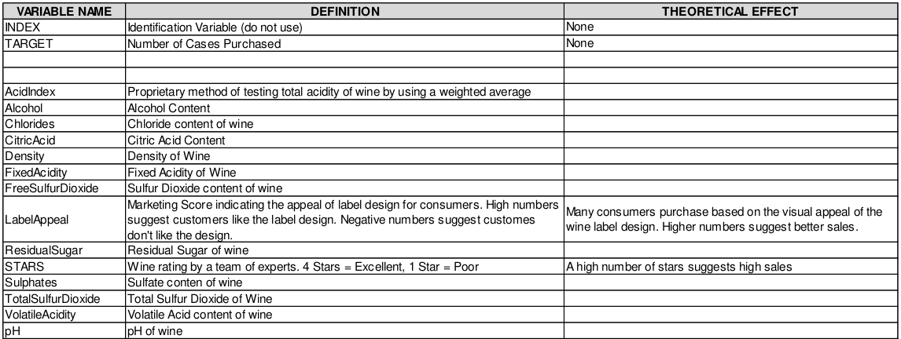

```{r setup, include=FALSE}
knitr::opts_chunk$set(echo = FALSE, results = 'hide')

library(tidyverse)
library(mice)
library(MASS)
library(ggcorrplot)
library(caret)

tr <- read.csv('wine-training-data.csv')
ev <- read.csv('wine-evaluation-data.csv')

miss <- c(6, 7, 8, 9, 11, 12, 13, 16)
```

# Exposition

Here we have a training set of about 12700 observations with the following features:



The variables are mostly related to the chemical properties of the wine being sold.  The response variable is the number of cases of wine being sold.  The response variable is the number of sample cases of wine that were purchased by wine distribution companies after sampling.  These cases would be used to provide tasting samples to restaurants and wine stores around the united states.

A large manufacturer is studying the data in prder to predict the number of win cases ordered based upon the wine characteristics.

We must build a counr regression model to predict the number of cases of wine that will be sold, given certain properties.

# Data Exploration and Preparation

```{r}
as.binMat <- function(df) {
  m <- c()
  for (i in colnames(df)) {
    x <- sum(is.na(df[,i]))
    m <- append(m, x)
    m <- append(m, nrow(df) - x)
  }
  
  a <- matrix(m, nrow = 2)
  rownames(a) <- c("Missing", "Present")
  colnames(a) <- colnames(df)
  
  return(a)
}

tr.binmat <- as.binMat(tr)
ev.binmat <- as.binMat(ev)
```

```{r, include = TRUE}
barplot(tr.binmat[,miss],
        main = "Missing information, training set")
colSums(is.na(tr))
```

There is a small amount of missing information in just 8 columns.  We can impute these values using a chained regression approach.

```{r}
fill.missing <- function(df, n) {
  imp <- miss - n
  x <- rbind(df)[,(n+1):16]
  y <- mice(x, maxit = 20)
  z <- complete(y, 1)

  compl <- cbind(x[,-imp], z[,imp])
  return(compl)
}

tr.f <- fill.missing(df = tr, n = 1)
ev.f <- fill.missing(df = ev, n = 2)

anyNA(ev.f)
anyNA(tr.f)
```

```{r, include=TRUE}
ggplot(tr, aes(x = TARGET)) + 
  geom_histogram(stat = 'count')
```

```{r, results=TRUE}
model.matrix(~0+., data=tr.f) %>% 
  cor(use="pairwise.complete.obs") %>% 
  ggcorrplot(show.diag = F, type="lower", lab=TRUE, lab_size=2)
```

Wow.  Apparently number of stars and label appeal are the only things that correlate strongly with the the target, and people are less likely to purchases cases of acidic wine.


```{r, echo=TRUE, results='asis'}
mean(tr.f$TARGET)
var(tr.f$TARGET)
```
The mean and variance are nearly the same, so this is a good candidate for modeling based ona Poisson distrbution.

# Build Models

We will build a model from the Poisson distribution with just the most meaningful variables listed above.  Then we will use a bidirectional stepwise selection based on the default complete set of features for the second version.

Then we do the same process for the negative binomial distribution.

Since we are trying to predict the number of tasting cases purchased based on the chemistry of these bottles, we can consider each purchase a progressive success.  It may be prudent to try to predict exactly how many "successes" there will be for each wine, or to try to predict how many "successes" will happen before a "failure", or an unsold case.

```{r results=FALSE, include=FALSE}
tr.tr <- tr.f[1:11000,]
tr.ev <- tr.f[11001:12795,]

m1 <- glm(TARGET ~ FixedAcidity + VolatileAcidity + CitricAcid +
            LabelAppeal + AcidIndex + pH + STARS,
          tr.tr, family = 'poisson')

m2 <- glm(TARGET ~ ., tr.tr, family = 'poisson') %>%
  stepAIC(direction = 'both', keep = NULL)

m3 <- glm.nb(TARGET ~ FixedAcidity + VolatileAcidity + CitricAcid +
            LabelAppeal + AcidIndex + pH + STARS,
            tr.tr)

m4 <- glm.nb(TARGET ~ ., tr.tr) %>%
  stepAIC(direction = 'both', keep = NULL)
```

# Select Models

```{r}
transform <- function(predictions) {
  p <- round(predictions - min(predictions))
  for (i in 1:length(predictions)) {
    if (p[i] != 0) {
      p[i] <- p[i] - 1
    }
  }
  return(as.factor(p))
}

p1 <- transform(predict(m1, tr.ev, type = 'response'))
p2 <- transform(predict(m2, tr.ev, type = 'response'))
p3 <- transform(predict(m3, tr.ev, type = 'response'))
p4 <- transform(predict(m4, tr.ev, type = 'response'))
```
### Confusion Matrices

```{r, results=TRUE}
table(p1,tr.ev[,1])
table(p2,tr.ev[,1])
table(p3,tr.ev[,1])
table(p4,tr.ev[,1])
```

All of these models perform fairly similarly.  They are based off of the same data, and the construction of their underlying models are equivalent in this type of situation.

There is a clear error that occurs with all of them.  They are pretty good at telling which bottles will make no sales at all.  They also don't tend to overshoot the sales of cases of wine across any of the case counts.  A good way to use this model would be to estimate the minimum cases likely to be sold.

# Export Predictions

```{r, include=TRUE}
p <- transform(predict(m4, tr.ev, type = 'response'))
write.csv(p, 'predictions.csv')

ggplot(data.frame(p), aes(x = p)) + 
  geom_histogram(stat = 'count')
```
So clearly, we have an issue.  This distribution does come as expected, but the distribution which described the sales of cases in the training set is a normal distribution.  My interpretation would be that these features can produce accurate predictions of minimum case sales, or tell which things just won't get sold.  However, the major determining factor for the actual number of cases sold, given that the wine is bought, is drunken randomness!

# Code Appendix

```
library(tidyverse)
library(mice)
library(MASS)
library(ggcorrplot)
library(caret)

tr <- read.csv('wine-training-data.csv')
ev <- read.csv('wine-evaluation-data.csv')

miss <- c(6, 7, 8, 9, 11, 12, 13, 16)

as.binMat <- function(df) {
  m <- c()
  for (i in colnames(df)) {
    x <- sum(is.na(df[,i]))
    m <- append(m, x)
    m <- append(m, nrow(df) - x)
  }
  
  a <- matrix(m, nrow = 2)
  rownames(a) <- c("Missing", "Present")
  colnames(a) <- colnames(df)
  
  return(a)
}

tr.binmat <- as.binMat(tr)
ev.binmat <- as.binMat(ev)

barplot(tr.binmat[,miss],
        main = "Missing information, training set")
colSums(is.na(tr))

fill.missing <- function(df, n) {
  imp <- miss - n
  x <- rbind(df)[,(n+1):16]
  y <- mice(x, maxit = 20)
  z <- complete(y, 1)

  compl <- cbind(x[,-imp], z[,imp])
  return(compl)
}

tr.f <- fill.missing(df = tr, n = 1)
ev.f <- fill.missing(df = ev, n = 2)

anyNA(ev.f)
anyNA(tr.f)

ggplot(tr, aes(x = TARGET)) + 
  geom_histogram(stat = 'count')

model.matrix(~0+., data=tr.f) %>% 
  cor(use="pairwise.complete.obs") %>% 
  ggcorrplot(show.diag = F, type="lower", lab=TRUE, lab_size=2)

mean(tr.f$TARGET)
var(tr.f$TARGET)

tr.tr <- tr.f[1:11000,]
tr.ev <- tr.f[11001:12795,]

m1 <- glm(TARGET ~ FixedAcidity + VolatileAcidity + CitricAcid +
            LabelAppeal + AcidIndex + pH + STARS,
          tr.tr, family = 'poisson')

m2 <- glm(TARGET ~ ., tr.tr, family = 'poisson') %>%
  stepAIC(direction = 'both', keep = NULL)

m3 <- glm.nb(TARGET ~ FixedAcidity + VolatileAcidity + CitricAcid +
            LabelAppeal + AcidIndex + pH + STARS,
            tr.tr)

m4 <- glm.nb(TARGET ~ ., tr.tr) %>%
  stepAIC(direction = 'both', keep = NULL)

transform <- function(predictions) {
  p <- round(predictions - min(predictions))
  for (i in 1:length(predictions)) {
    if (p[i] != 0) {
      p[i] <- p[i] - 1
    }
  }
  return(as.factor(p))
}

p1 <- transform(predict(m1, tr.ev, type = 'response'))
p2 <- transform(predict(m2, tr.ev, type = 'response'))
p3 <- transform(predict(m3, tr.ev, type = 'response'))
p4 <- transform(predict(m4, tr.ev, type = 'response'))

table(p1,tr.ev[,1])
table(p2,tr.ev[,1])
table(p3,tr.ev[,1])
table(p4,tr.ev[,1])

p <- transform(predict(m4, tr.ev, type = 'response'))
write.csv(p, 'predictions.csv')

ggplot(data.frame(p), aes(x = p)) + 
  geom_histogram(stat = 'count')
```
